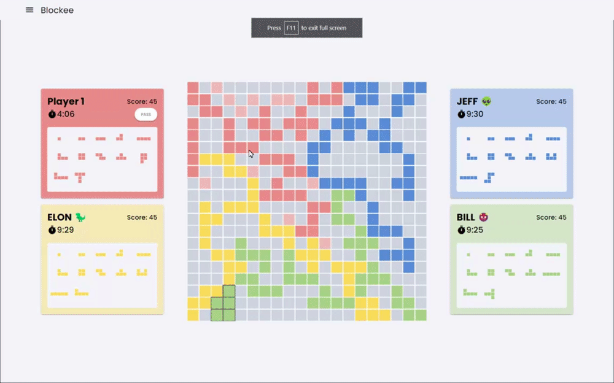

<h1 align="center">
  Blockee
  <br>
</h1>

<h3 align="center">The board game "Blokus" built on top of <a href="https://quasar.dev/" target="_blank">Quasar</a>.</h3>
<p align="center">https://blockee.netlify.app</p>
<p align="center">
  <a href='https://play.google.com/store/apps/details?id=org.groupP.blockee.app&pcampaignid=pcampaignidMKT-Other-global-all-co-prtnr-py-PartBadge-Mar2515-1'></a>
</p>
<br />

<div align="center">
    
</div>

## About

The aim of the game is for players to place as many pieces on the board as possible. <br />
Each player starts with 21 unique pieces and must place each piece diagonally adjacent to another. <br />
Points are accumulated based on the size (length) of the piece placed by the player. <br />
The game ends when all players have placed their pieces, or when no players can place anymore pieces.

## Features

- Options for local 2 players / 4 players
<p align="center">
  
</p>

- Replay system to review current played game
<p align="center">
  
</p>

- CPU with variable difficulty
  - easy -> randomly places pieces on the board
  - medium -> prioritizes placing the current largest piece randomly on the board
  - hard -> utilizes a greedy algorithm which evaluates the weight of each currently available piece relative to the current board state, and places the piece with the highest weight onto the board. The weight evaluation was defined as the following:

$$ w_i = size_i \cdot W_0 + \frac{\sum(cor_{my} - cor_{opp})}{n_{opp}} \cdot W_1 $$

<p align="center">
  where,
</p>

$$ w_i = \text{weight of piece } i $$

$$ size_i = \text{size (length) of piece } i $$

$$ cor_{my} = \text{number of corners for current player} $$

$$ cor_{opp} = \text{number of corners for opponent players} $$

$$ n_{opp} = \text{number of opponents} $$

## How to run

### Install the dependencies
```bash
yarn
# or
npm install
```

### Start the app in development mode (hot-code reloading, error reporting, etc.)
```bash
quasar dev
```

### Build the app for production
```bash
quasar build
```
